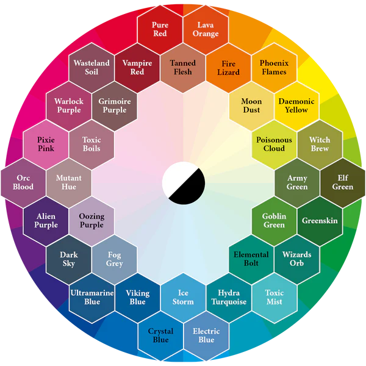
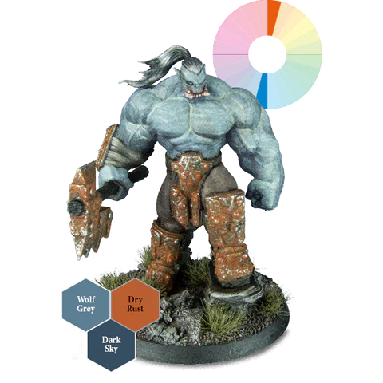
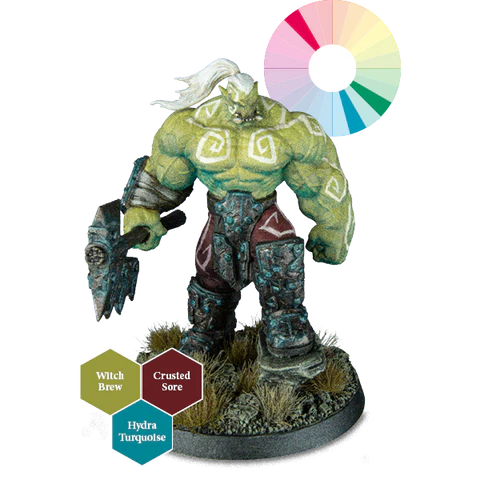
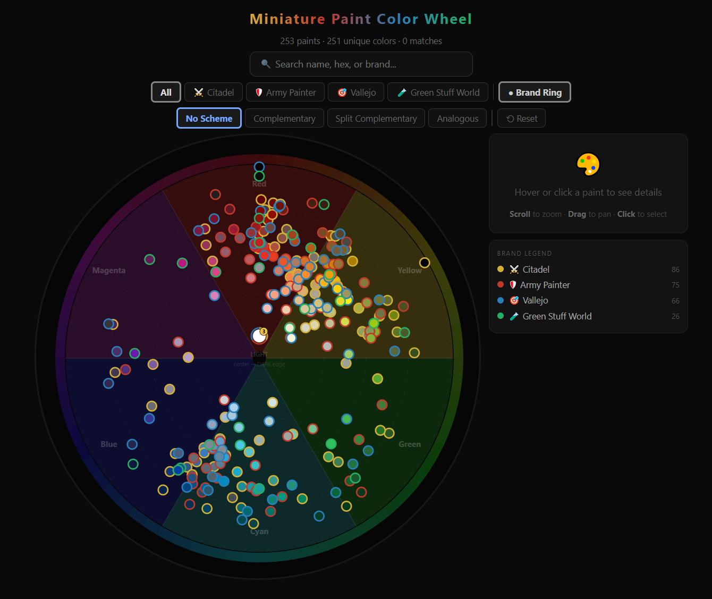

# From Prompt to Product

Using Claude to ship a feature-rich app — one release at a time.

alpha.grimify.app → beta.grimify.app → grimify.app

---

## Nathan Healea

- Analyst Programmer II
- Web Application Team — _Information Services_
- 3+ years @ UO
- 10+ years as a Full-Stack Developer & Software Engineer
- Finance · Healthcare · Higher Education

---

## "I wish this was interactive."

Inspired by [The Army Painter's guide to picking a colour scheme](https://thearmypainter.com/blogs/explore/how-to-pick-a-colour-scheme).
 

|  |  |  |
| :---------------------------------------------------------: | :-----------------------------------------------------------------: | :--------------------------------------------------------: |
|                       _Complementary_                       |                        _Split-complementary_                        |                        _Analogous_                         |

### Prompt

> I'm wanting to create a interactive color wheel for viewing, selecting paints basted on different color theory factors.
> The color wheel should have the following features:
>
> - Colors should be placed on the color wheel.
> - Darker colors should appear further out, while lighter colors appear further in.
> - Colors should be placed on the color wheel based on mathematically based on there hexadecimal values.
> - Users should be able to zoom in on the color wheel, when they do so colors should dissipate out showing more gap between repressing there color differences.
> - Users should be table to select. color schemes and have those areas emphasized on the color wheel.
>   - Complementary Colors
>   - Slit Complementary Colors.
>   - Analogous Colors.

<!-- ---

## The Approach — Ship in Public, One Version at a Time

Rather than build in private for a year, I gave myself three named milestones and shipped each one to the open web.

| Version               | Focus                | What "done" looked like                                     |
| --------------------- | -------------------- | ----------------------------------------------------------- |
| **alpha.grimify.app** | _Foundation_         | Paint data, search, an interactive color wheel              |s
| **beta.grimify.app**  | _Depth_              | Cross-brand comparison, color schemes, personal collections |
| **grimify.app**       | _Polish & community_ | Palettes, painting recipes, admin tools, public sharing     |

Each version is a deployed environment — not a branch, not a slide. Claude was the constant; the **product** is what kept changing.

**Stack:** Next.js · React · TypeScript · Supabase (Postgres + Auth + RLS) · Tailwind / shadcn -->

---

## alpha.grimify.app - Foundation

The first version that proved the idea could exist at all.

- **Paint Data & Search** - paint/brand/hue data model, seed catalog, search by name, hex, or brand
- **Interactive Color Wheel** - paints rendered by hue and lightness, zoom + pan, paint detail view
- **Color schemas** - complementary, split complementary, analogous color indicators.

### More Features

- **Improved Paint Catalog & Data** - more paints, better color information
- **Personal Collection** - Users should be able to catalog the colors they have, easily identify there colors on color wheel.
- **Better Filters** - Users should be able to filter by: brands, color scheme, own collection 

_LINK: [alpha.grimify.app](https://alpha.grimify.app)_

---

## beta.grimify.app - Depth

Once the foundation was real, then the features expanded, problems started to arise.

- **Cross-brand comparison** — color-distance engine, side-by-side UI, similar paints on every paint detail page, substitutes for discontinued paints
- **Color scheme explorer** — complementary, split-complementary, analogous, and triadic scheme generation; schemes surfaced on every paint
- **Collection tracking** — add/remove paints, personal collection dashboard, toast feedback
- **Color wheel, refined** — HSL wheel, Itten segment boundaries, brand rings & halos, filter by brand / collection / owned

### Problems
- **User Collection** - Utilized the browser storage, no backend database.
- **User Accounts** - Without a user account, profiles, collections, could not be saved or shared.
- **Data** - Expanding the paint catalog, data, statics files started to become large and needed to load over 2K paints at once.    

_LINK: [beta.grimify.app](https://beta.grimify.app)_

---

## grimify.app - Polish

The version where Grimify stops being a _tool_ and starts being an _application_.

- **Color palettes** — build personal palettes from any source (including the scheme explorer), drag-and-drop reorder, hue-locked HSL swap, markdown descriptions, palette groups, public catalog
- **Painting recipes** — step-by-step recipe builder with sections, techniques, paint ratios, photos, freeform notes
- **Admin & user management** — admin dashboard, role management, account management, collection management
- **Polish everywhere** — toast feedback across auth, collections, palettes, schemes, and admin flows

_LINK: [grimify.app](https://grimify.app)_

---

## What Claude Actually Made Possible

Three deployed environments, dozens of features — built solo, on nights and weekends. None of it works without these three things:

- **`CLAUDE.md` as the project contract** — tech stack, domain-module structure, naming conventions, workflow routing. Claude reads it before every command.
- **A four-command spine** — `/plan` writes the feature doc, `/implement` walks the diff one commit at a time inside a worktree, `/stage` runs build + lint and opens the PR, `/release` cleans up after merge.

The same pattern is now what I reach for at work — different remote, same muscle memory.

---

## Thanks

Questions?
